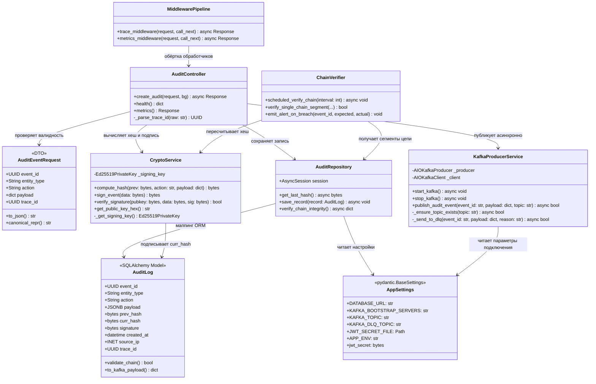
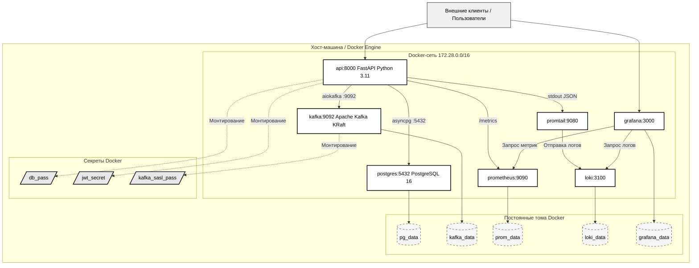
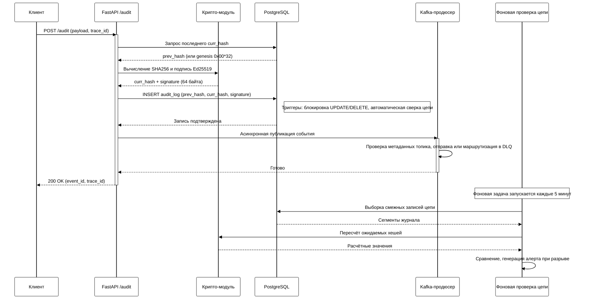

# kafka-event-sourcing

```mermaid
---
config:
  layout: fixed
---
flowchart TB
 subgraph ClientLayer["Клиентский уровень"]
        Client["REST-клиент"]
        GrafanaUI["Интерфейс Grafana"]
  end
 subgraph Crypto["Криптографический модуль"]
        HashFn["compute_hash"]
        SignFn["sign_event"]
        VerifyFn["verify_signature"]
  end
 subgraph DBLayer["Слой работы с БД"]
        Session["Асинхронная сессия SQLAlchemy"]
        Models["Модель AuditLog"]
        Repo["get_last_hash"]
  end
 subgraph KafkaLayer["Продюсер Kafka"]
        Producer["AIOKafkaProducer"]
        RetryDLQ["Логика повторов и DLQ"]
        MetaCheck["Проверка метаданных топиков"]
  end
 subgraph Backend["Серверная часть FastAPI"]
    direction TB
        Middleware["Middleware TraceID, метрики"]
        Routes["Маршруты /audit, /health, /metrics"]
        BgTasks["Фоновые задачи"]
        Crypto
        DBLayer
        KafkaLayer
        Verifier["Фоновая проверка цепочки"]
  end
 subgraph Infra["Инфраструктура"]
        PostgreSQL[("PostgreSQL 16")]
        Kafka[("Apache Kafka KRaft")]
        Prometheus[("Prometheus")]
        Loki[("Loki")]
        Grafana[("Grafana")]
        Promtail["Promtail"]
  end
    Client --> Routes
    GrafanaUI --> Prometheus & Loki
    Routes --> Middleware
    Middleware --> Crypto & Session & Producer
    Crypto --> HashFn & SignFn
    Session --> Models & Repo
    Producer --> RetryDLQ & MetaCheck
    BgTasks --> Verifier
    PostgreSQL -. Триггеры .-> AppendOnly["enforce_append_only"] & ChainTrig["verify_hash_chain"]
    Kafka -- audit_events --> EventsTopic["Топик audit_events"]
    Kafka -- audit_dlq --> DLQTopic["Топик audit_dlq"]
    Routes -- /metrics --> Prometheus
    Routes -- stdout JSON --> Promtail
    Promtail -- Отправка --> Loki

     SignFn:::security
     VerifyFn:::security
     Crypto:::security
     PostgreSQL:::infra
     Kafka:::infra
     Prometheus:::infra
     Loki:::infra
     Grafana:::infra
     Promtail:::infra
     AppendOnly:::security
     ChainTrig:::security
    classDef layer fill:#ffffff,stroke:#000000,color:#000000,stroke-width:2px
    classDef security fill:#f5f5f5,stroke:#000000,color:#000000
    classDef infra fill:#e8e8e8,stroke:#000000,color:#000000
```

```mermaid
classDiagram
    class AuditLog {
        <<SQLAlchemy Model>>
        +UUID event_id
        +String entity_type
        +String action
        +JSONB payload
        +bytes prev_hash
        +bytes curr_hash
        +bytes signature
        +datetime created_at
        +INET source_ip
        +UUID trace_id
        +validate_chain() bool
        +to_kafka_payload() dict
    }

    class AuditEventRequest {
        <<DTO>>
        +UUID event_id
        +String entity_type
        +String action
        +dict payload
        +UUID trace_id
        +to_json() str
        +canonical_repr() str
    }

    class CryptoService {
        -Ed25519PrivateKey _signing_key
        +compute_hash(prev: bytes, action: str, payload: dict) bytes
        +sign_event(data: bytes) bytes
        +verify_signature(pubkey: bytes, data: bytes, sig: bytes) bool
        +get_public_key_hex() str
        -_get_signing_key() Ed25519PrivateKey
    }

    class AuditRepository {
        +AsyncSession session
        +get_last_hash() async bytes
        +save_record(record: AuditLog) async void
        +verify_chain_integrity() async dict
    }

    class KafkaProducerService {
        -AIOKafkaProducer _producer
        -AIOKafkaClient _client
        +start_kafka() async void
        +stop_kafka() async void
        +publish_audit_event(event_id: str, payload: dict, topic: str) async bool
        -_ensure_topic_exists(topic: str) async bool
        -_send_to_dlq(event_id: str, payload: dict, reason: str) async bool
    }

    class AuditController {
        +create_audit(request, bg) async Response
        +health() dict
        +metrics() Response
        -_parse_trace_id(raw: str) UUID
    }

    class MiddlewarePipeline {
        +trace_middleware(request, call_next) async Response
        +metrics_middleware(request, call_next) async Response
    }

    class ChainVerifier {
        +scheduled_verify_chain(interval: int) async void
        +verify_single_chain_segment(...) bool
        +emit_alert_on_breach(event_id, expected, actual) void
    }

    class AppSettings {
        <<pydantic.BaseSettings>>
        +DATABASE_URL: str
        +KAFKA_BOOTSTRAP_SERVERS: str
        +KAFKA_TOPIC: str
        +KAFKA_DLQ_TOPIC: str
        +JWT_SECRET_FILE: Path
        +APP_ENV: str
        +jwt_secret: bytes
    }

    AuditController --> AuditEventRequest : проверяет валидность
    AuditController --> CryptoService : вычисляет хеш и подпись
    AuditController --> AuditRepository : сохраняет запись
    AuditController --> KafkaProducerService : публикует асинхронно
    AuditRepository --> AuditLog : маппинг ORM
    AuditRepository --> AppSettings : читает настройки
    KafkaProducerService --> AppSettings : читает параметры подключения
    CryptoService --> AuditLog : подписывает curr_hash
    ChainVerifier --> AuditRepository : получает сегменты цепи
    ChainVerifier --> CryptoService : пересчитывает хеш
    MiddlewarePipeline --> AuditController : обёртка обработчиков
```

```mermaid
flowchart TD
    subgraph Host[Хост-машина / Docker Engine]
        subgraph Network[Docker-сеть 172.28.0.0/16]
            API[api:8000 FastAPI Python 3.11]
            DB[postgres:5432 PostgreSQL 16]
            KAFKA[kafka:9092 Apache Kafka KRaft]
            PROM[prometheus:9090]
            LOKI[loki:3100]
            GRAFANA[grafana:3000]
            PROMTAIL[promtail:9080]
        end

        subgraph Volumes[Постоянные тома Docker]
            PG_VOL[(pg_data)]
            KAFKA_VOL[(kafka_data)]
            PROM_VOL[(prom_data)]
            LOKI_VOL[(loki_data)]
            GRAFANA_VOL[(grafana_data)]
        end

        subgraph Secrets[Секреты Docker]
            DB_SEC[/db_pass/]
            JWT_SEC[/jwt_secret/]
            KAFKA_SEC[/kafka_sasl_pass/]
        end
    end

    External[Внешние клиенты / Пользователи] --> API
    External --> GRAFANA

    API -->|asyncpg :5432| DB
    API -->|aiokafka :9092| KAFKA
    API -->|/metrics| PROM
    API -->|stdout JSON| PROMTAIL
    PROMTAIL -->|Отправка логов| LOKI

    GRAFANA -->|Запрос метрик| PROM
    GRAFANA -->|Запрос логов| LOKI

    DB --> PG_VOL
    KAFKA --> KAFKA_VOL
    PROM --> PROM_VOL
    LOKI --> LOKI_VOL
    GRAFANA --> GRAFANA_VOL

    API -.->|Монтирование| DB_SEC
    API -.->|Монтирование| JWT_SEC
    KAFKA -.->|Монтирование| KAFKA_SEC

    classDef container fill:#ffffff,stroke:#000000,color:#000000,stroke-width:2px
    classDef volume fill:#f5f5f5,stroke:#333333,color:#000000,stroke-dasharray: 5 5
    classDef secret fill:#e8e8e8,stroke:#000000,color:#000000,stroke-width:2px
    classDef external fill:#f0f0f0,stroke:#000000,color:#000000

    class API,DB,KAFKA,PROM,LOKI,GRAFANA,PROMTAIL container
    class PG_VOL,KAFKA_VOL,PROM_VOL,LOKI_VOL,GRAFANA_VOL volume
    class DB_SEC,JWT_SEC,KAFKA_SEC secret
    class External external
```

```mermaid
%%{init: {'theme': 'base', 'themeVariables': {
  'primaryColor': '#ffffff', 'primaryTextColor': '#000000', 'primaryBorderColor': '#000000',
  'lineColor': '#000000', 'secondaryColor': '#ffffff', 'tertiaryColor': '#f5f5f5',
  'actorBkg': '#ffffff', 'actorBorder': '#000000', 'actorTextColor': '#000000', 'actorLineColor': '#000000',
  'signalColor': '#000000', 'signalTextColor': '#000000',
  'noteBkgColor': '#ffffff', 'noteBorderColor': '#000000', 'noteTextColor': '#000000',
  'loopTextColor': '#000000', 'activationBorderColor': '#000000', 'activationBkgColor': '#f5f5f5',
  'rectBorder': '#000000'
}}}%%

sequenceDiagram
    participant Клиент
    participant API as FastAPI /audit
    participant Крипто as Крипто-модуль
    participant БД as PostgreSQL
    participant Kafka as Kafka-продюсер
    participant Верификатор as Фоновая проверка цепи

    Клиент->>API: POST /audit (payload, trace_id)
    activate API
    API->>БД: Запрос последнего curr_hash
    БД-->>API: prev_hash (или genesis 0x00*32)

    API->>Крипто: Вычисление SHA256 и подпись Ed25519
    Крипто-->>API: curr_hash + signature (64 байта)

    API->>БД: INSERT audit_log (prev_hash, curr_hash, signature)
    Note right of БД: Триггеры: блокировка UPDATE/DELETE, автоматическая сверка цепи
    БД-->>API: Запись подтверждена

    API->>Kafka: Асинхронная публикация события
    activate Kafka
    Kafka->>Kafka: Проверка метаданных топика, отправка или маршрутизация в DLQ
    Kafka-->>API: Готово
    deactivate Kafka
    API-->>Клиент: 200 OK (event_id, trace_id)
    deactivate API

    Note over Верификатор: Фоновая задача запускается каждые 5 минут
    Верификатор->>БД: Выборка смежных записей цепи
    БД-->>Верификатор: Сегменты журнала
    Верификатор->>Крипто: Пересчёт ожидаемых хешей
    Крипто-->>Верификатор: Расчётные значения
    Верификатор->>Верификатор: Сравнение, генерация алерта при разрыве
```
